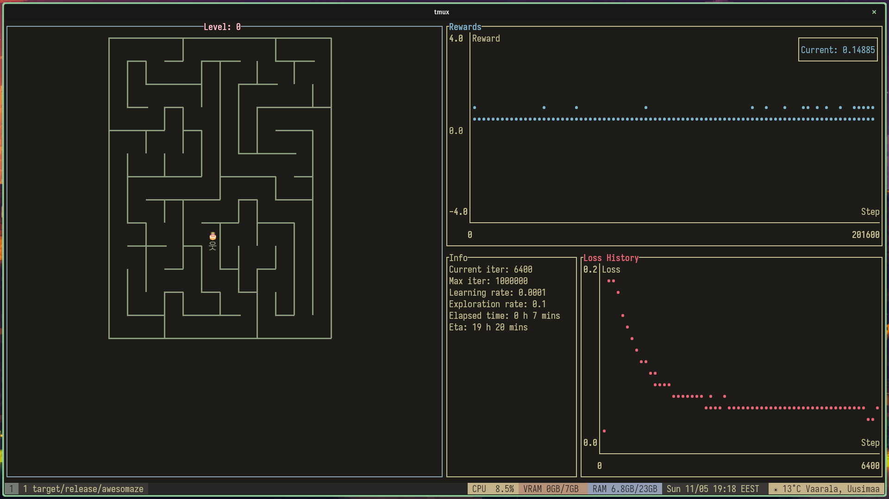
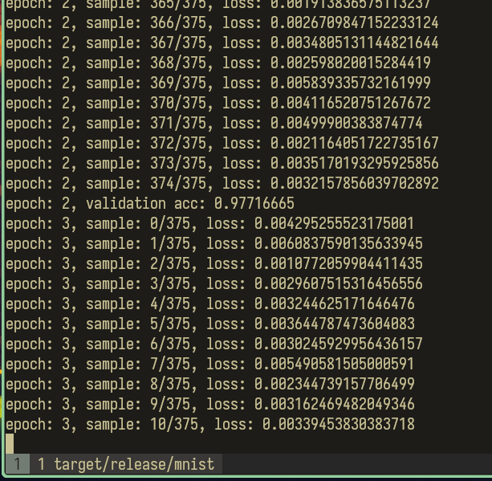
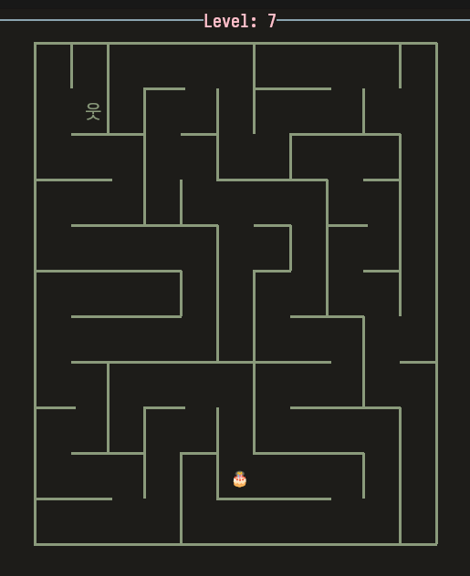

# Awesomaze
 
This project is my learning project for learning Rust Programming Language. It includes 2 crates: `awesomaze_maze` for Reinforcement Learning environment for maze solving with a terminal UI (using [ratatui](https://ratatui.rs/)) with a Deep Q-Learning example and `awesomlearn` as a Tensor Library with 2 implemented backends: 1. naive CPU backend 2. GPU backend using [wgpu](https://wgpu.rs/) compute shaders. It also has basic Neural Network training capabilities.

## Awesomlearn
A crate containing a tensor library with 2 backends: CPU and GPU (with wgpu compute shaders) with automatic differentation. Basic Neural Netowork training capabilities with implementation of layer types like `Dense`, `Conv2d` and `MaxPool2d` and an [AdamW](https://arxiv.org/abs/1711.05101) optimizer.
### CPU backend
This is a naive cpu implementation of tensor operations mostly to test results against the wgpu backends compute shader implementations. Doesn't use SIMD or doesn't consider cache locality. Just naive implementations for each operations.
### Wgpu backend
Uses handwritten compute shaders with minimal codegen for passing kernel parameters for the compute shaders.

### Mnist example
The crate has a simple mnist training example in [mnist.rs](awesomlearn/src/bin/mnist.rs) . 

You can run the example with:
```
cargo run --bin mnist "/path/to/mnist/dataset/"
```

## Awesomaze Maze
This crate has a Maze solving Reinforcement Learning environment. It has an implementation of Deep Q-Learning agent to get to the cake.



The training currently support using either the `awesomlearn` crate in this repo or the [burn crate](https://docs.rs/burn/latest/burn/). The environment creates a random maze with maximum size of  16, 32 or 64 depending on the set difficulty level.
The environment can be run either in `play`, `train` or `watch` mode. The binary uses [clap](https://docs.rs/clap/latest/clap/) for commandline usage so check help with `--help`.
## Train
The agent can be trained with multiple different configurations, including specifying amount of parallel-envs and diffculty (the max size of the maze). Basic training can be started after building the executable by:
```
./awesomaze train
```
Use `./awesomaze train --help` for more information about the different configurations.

## Watch
You can watch a trained model trying to solve the mazes by running the bin with:
```
./awesomaze watch "path/to/model" model_type difficulty
```
The `model_type` and `difficulty` must correspond to the settings the model was trained on. The burn models are saved as `.mpk` and the awesomlearn models are saved as plain `.json` at the moment. There is a pretrained model for the burn in [awesomaze_maze/pretrained/burn_model_hard.mpk](awesomaze_maze/pretrained/burn_model_hard.mpk) which can be run with:
```
cargo run --bin awesomaze -- watch "./awesomaze_maze/pretrained/burn_model_hard.mpk" -- burn hard
```

# TODO
- [ ] There is some unstability in the awesomlearn training and would be interesting to find what causes this. Would require more testing.
- [ ] Documentation
